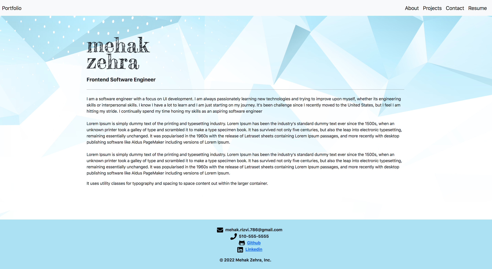
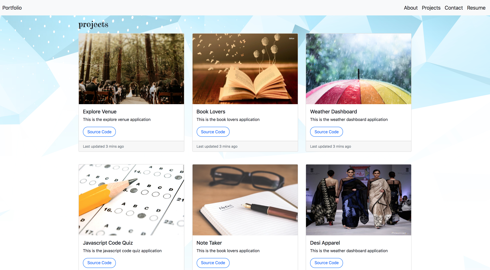
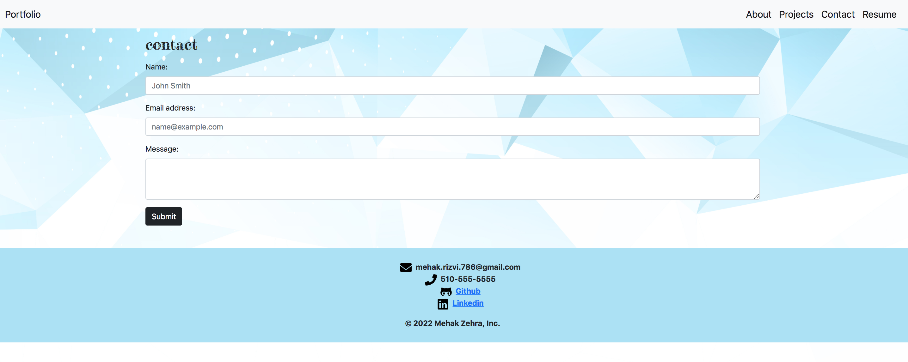
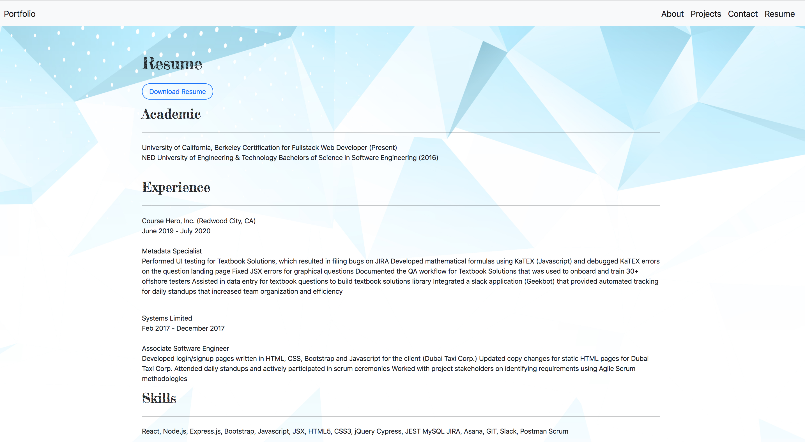

# applicant-portfolio
## Purpose
This the portfolio application that list information about an applicant's personal information as well as recent projects, contact information, along with there resume

## Built With
* React
* Bootstrap
* Node.js
* HTML
* CSS

## Live Website
https://mehak-zehra-resume.herokuapp.com/

## GitHub Repository
https://github.com/mehak-zehra/my-portfolio

## Screenshots
## Desktop Version:

## Contribution
Made with ❤️ by [Mehak Zehra]
